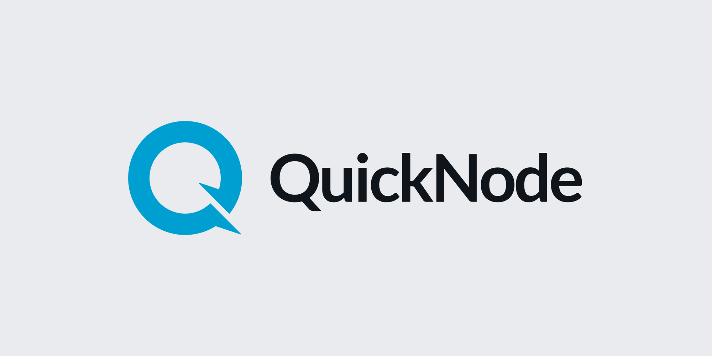

# QuickNode

Hey, there! Welcome to the QuickNode GitHub page. 👋

QuickNode is the backbone of blockchain development, empowering the Web3 revolution with our robust and scalable blockchain infrastructure. As a premier platform, we provide developers with the high-performance tools and services needed to build the next generation of decentralized applications. Dive into our repositories to find cutting-edge solutions for seamless blockchain integration. ✅

Join us in accelerating the world's transition to decentralized technologies. Explore, contribute, and build with QuickNode — where speed, reliability, and security meet innovation. 🚀
